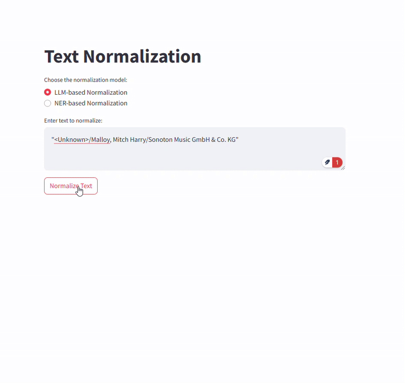

# Text-Normalization
Text Normalization is a Python project aimed to normalize the raw composition writer’s information by removing redundant information, and keeping only the writer names in the output.

<p align="center">
    
</p>

---
## Dataset
The [dataset](src/data/normalization_assesment_dataset_10k.csv) provided is a CSV file containing 10000 raw compositions from writers' texts and the normalized version:
- raw_comp_writers_text : Original text containing composer and writer information.
- CLEAN_TEXT : The clean normalized text after removing redundant information.

## Data Analysis
A notebook with basic data analysis is provided [here](notebooks_general/dataset_analysis.ipynb). The notebook contains some basic analysis of the data in order to understand the structure and types of information it contains, as well as identify possible redunduncies.

## Installation
1. Clone the repository:
```bash
git clone https://github.com/mkatras11/Text-Normalization.git
cd Text-Normalization
```

2. Create and activate virtual environment (python 3.11.7):
```bash
python -m venv .venv

# On Windows:
.venv\Scripts\activate
# On macOS/Linux:
source .venv/bin/activate
```

3. Install dependencies:
```bash
pip install -r requirements.txt
```

4. Create a `.env` file in the root directory:
```
OPENAI_API_KEY= <your_api_key_here>
```

## Running the Application

### Running with Docker
To run the application using Docker, run the following command in the root directory of the project:
```bash
docker compose up # or docker-compose up
```
Access the application via the following link: [http://localhost:8501/](http://localhost:8501/)

You can choose the model of your preference from the menu and input the text you want to normalize.

### Running Locally
Firstly, you need to download the model by running the following command:
```bash
python get_model.py
```
This will download the model and save it in the main directory of the project.
Then you need to install the model with `pip`. To do so, run the following command:
```bash
pip install ./model.tar.gz
```
To run the application locally, run the following command in the root directory of the project:
```bash
cd src
uvicorn app:app --host 0.0.0.0 --port 8080
```
In a new terminal window run the following command to access the application:
```bash
streamlit run src/client.py
```


## Retraining the NER model

### Dataset Preparation
To prepare the dataset for training the NER model, run the following command:
```bash
cd src
python -m text_norm_NER.dataset_preparation
```
This will split the data into training, testing and validation sets, transform the data into the required format for training the model, and save the data in the `data/data_ner` directory.

### Retraining
To retrain the NER model, you can follow the instructions in the [notebook](src/text_norm_NER/retraining_spacy.ipynb).


## Inference and Evaluation

### NER Model
To inference with the retrained NER model, run the following command:
```bash
python -m text_norm_NER "text to normalize"
```

### LLM Model
To inference with the LLM model, run the following command:
```bash
python -m text_norm_LLM "text to normalize"
```
To evaluate the LLM model, run the following command:
```bash
python -m text_norm_LLM.evaluate_model
```

## Testing
To run the tests, run the following command:
```bash
pytest tests\test_data_preproc.py
```
